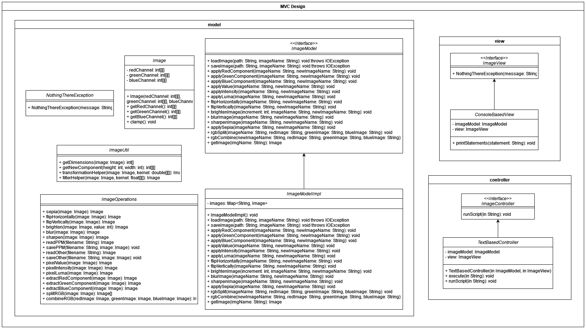

# PerfectPixel

## Project Overview

This project contains a set of image processing commands applied to an image. The script performs operations such as extracting color components, flipping, applying filters (sepia, greyscale, etc.), and combining channels, all on a single image. The commands can be run through a script file, executing various transformations in sequence.

## Folder Structure
This project follows an MVC architecture, with organized directories for images, source code (model, view, controller, main ), and Unit tests for each component.

    .
    ├── images                # Contains project-related images
    ├── src                   # Source code for the application      
    │   ├── model             # Business logic    
    │   ├── view              # View Componenets 
    │   ├── controller        # Application logic and user input handling      
    │   ├── Main              # Entry point of the application  
    │   
    ├── test                  # Contains Unit testing 
    │   ├── testmodel         # Model Testing         
    │   ├── testview          # View Testing       
    │   ├── testcontroller    # Controller Testing    
    └── ...

## Classes & Interfaces
Below is the class diagram for the application,


**ImageController.java:** This is an Interface for the Controller. It executes the commands provided for image loading, manipulation or storing.
**TextBasedController.java:** This class represents the Controller, acting as the mediator between the inputs from the View and the different operations to be preformed from the Model.

**Image.java:** This is the representation class of any Image that is going to be processed in the entire application. It contains 3 channels, Red, Green and Blue as 2D Arrays. It also contains logic for intensity, luma and value for a particular pixel.
**ImageModel.java:** This interface defines a set of operations that can be performed on the images. It provides operations like loading, saving, and applying transformations to images, changing color components, flipping, brightening, filter, and transformations.
**ImageModelImpl.java:** This class provides functionality to manage and manipulate images. It supports operations like loading, saving, applying color filters, transforming, and combining images. The images can be loaded and saved in different formats, and the class offers various methods to extract and manipulate specific color components (red, green, blue) or grayscale versions of images (based on value, intensity, and luma).
**ImageOperations.java:** This class contains the logic for all the operations that should be performed on the images. Some of the supported operations are filters, transforms, splitting and combining RGB images.
**ImageUtil.java:** This is a utilities class for the ImageModel. It abstracts some of the operations to be performed on the images, like fetching the image dimensions, abstracting logic for filters and transformations.
**NothingThereException.java:** A custom exception class when the image has no pixels defined.

**ImageView.java:** This is an Interface for the View. It displays all the output statements to the end user.
**ConsoleBasedView.java:** This class represents the View, it will display the logs for each operation asked by the user.

## How to Use

### 1. Fetching & Passing 
In the root directory of the project, ensure there is a folder named images, which should contain the following two subdirectories:

    input/: This directory holds the input images that the program processes.
    output/: This directory stores the output images generated by the program.

Make sure to place and check the appropriate images in their respective directories before running the project.

### 2. Compilation Instructions

To compile the Java files, ensure that you are inside the `src` directory of the project. Depending on your operating system and shell, use one of the following commands:

- **PowerShell**:
  ```powershell
  Get-ChildItem -Recurse -Filter *.java | ForEach-Object { javac -d ../res $_.FullName }
  
- **Command Prompt (CMD)**:
  ```
  for /r %i in (*.java) do javac -d ..\res "%i"

- **Git Bash / Linux**:
  ```
  find . -name "*.java" -exec javac -d ../res {} \;

- **macOS (Option 1):**:
  ```
  find . -name "*.java | xargs javac -d ../res

- **macOS (Option 1):**:
  ```
  for file in $(find . -name "*.java"); do javac -d ../res "$file"; done

Each of these commands will recursively find all Java files in the src directory and compile them into the res directory.

### 3. Running the Program

To run the application, follow these steps:

1. Open your terminal or command prompt.
2. Navigate to the root directory of the project.
3. Execute one of the following commands:


**Option 1: Without Command Line Arguments**

- If you do not need to pass any command line arguments, use:

   ```
   java -cp res Main
  
**Option 2: With Command Line Arguments**

- If you need to pass command line arguments, replace `filename` with your desired argument and use::

   ```
   java -cp res Main fileName

- The given file should be in the root directory of the project.


### Script Commands
As all input images are inside /images/input, user needs to give "/input/fileName" to load images.

As all output images are inside /images/output, user needs to give "/output/fileName" to save image.

This is the done to improvise clarity while loading, manipulation, enhancement and saving of multiple images, avoid confusion and keep images segregated.

Below are some sample examples on how commands should be written in script file to get desired output:
- Load an image and name it\
`load input/sample.ppm sample`<br/><br/>

- Save a loaded image named "sample"\
`save input/sample.ppm sample`<br/><br/>

- Create a new image with just the red component\
`red-component sample sample-red`<br/><br/>

- Create a new image with just the green component\
`green-component sample sample-green`<br/><br/>

- Create a new image with just the blue component\
`blue-component sample sample-blue`<br/><br/>

- Create a new image using the value component\
`value-component sample sample-value`<br/><br/>

- Create a new image using the intensity component\
`intensity-component sample sample-intensity`<br/><br/>

- Create a new image using the luma component\
`luma-component sample sample-luma`<br/><br/>

- Split the image into RGB components\
`rgb-split sample sample-red sample-green sample-blue`<br/><br/>

- Combine 3 different red, green, and blue component images into a single image\
`rgb-combine sample-new sample-red sample sample`<br/><br/>

- Brighten the image by adding a constant (here, 25)\
`brighten 25 sample sample-brighter`<br/><br/>

- Darken the image by adding a negative constant (here, -25)\
`brighten -25 sample sample-brighter`<br/><br/>

- Flip the image horizontally\
`horizontal-flip sample sample-horizontal`<br/><br/>

- Flip the image vertically\
`vertical-flip sample sample-vertical`<br/><br/>

- Add sepia transform to the image\
`sepia sample sample-sepia`<br/><br/>

- Add blur filter to the image\
`blur sample sample-blur`<br/><br/>

- Add sharpen filter to the image\
`sharpen sample sample-greyscale`<br/><br/>

- Overwrite the image with another file\
`load input/sample.ppm sample`<br/><br/>

  
### 4. Citation

- The images used in this project are either "clicked and owned" or "created and owned" by
[@shivang2402](https://github.com/shivang2402) or [@ShahParin](https://github.com/ShahParin). Please credit accordingly if used elsewhere.
