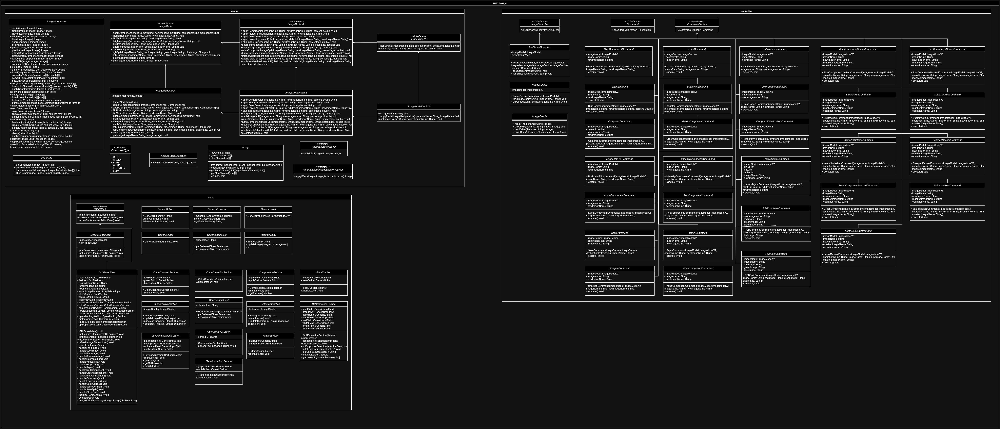

# PerfectPixel

## Project Overview
PerfectPixel is a Java-based image processing application. It supports a range of image processing operations such as color adjustments, filtering, transformations, and image compression. Users can interact with the application via text-based scripts or command-line inputs to perform various image manipulations.

## Features
- **Load/Save Images**: Supports JPG, JPEG, PNG, and PPM file formats.
- **Channel Visualization**: Isolates the red, green, or blue channels for analysis or display.
- **Brightness Adjustment**: Brightens or darkens an image by adjusting each pixel's color values.
- **Image Flipping**: Provides options to flip images horizontally or vertically.
- **Filtering**:
  - **Blur**: Applies a Gaussian blur to soften image details.
  - **Sharpen**: Enhances image edges for a crisper look.
- **Color Transformations**:
  - **Greyscale**: Converts images to greyscale using the Luma transformation.
  - **Sepia Tone**: Applies a sepia filter to get the characteristic reddish brown tone of 19th century images.
- **Image Compression**:
  - **Haar Wavelet Transform**: Applies a customizable compression by utilizing the Haar Wavelet.
- **Histograms**:
  - **Visualization**: Generates a histogram displaying the color intensity distribution across the red, green, and blue channels.
  - **Color Correction**: Adjusts the color balance by aligning histogram peaks of individual channels.
  - **Levels Adjustment**: Enhances image contrast using black, midtone, and white points on the histogram.
- **Split View Preview**: Provides a side-by-side view of the original and modified image to visualize transformations in real time.


## Folder Structure
This project follows an MVC architecture, with organized directories for images, source code (Model, View, Controller, Main), and Unit tests for ease of understanding.
```
  .
  ├── inputImages             # Contains project-related images
  ├── res                     # Contains output images, scripts and UML diagram
  │   ├── outputImages        # Images produced by the application      
  │   ├── PerfectPixel.jar    # The JAR file for execution      
  ├── src                     # Source code for the application      
  │   ├── controller          # Application logic and user input handling      
  │   ├── model               # Business logic    
  │   ├── view                # View Components
  │   └── Main                # Entry point of the application  
  ├── test                    # Contains Unit testing
  │   ├── testcontroller      # Controller Testing    
  │   ├── testmodel           # Model Testing         
  │   └── testview            # View Testing       
  ├── README.md               # Overview of the project, features supported, dependencies, and testing
  └── USEME.md                # Contains detailed instructions on how to use the project for end-users
```

## Classes & Interfaces
Below is the class diagram for the application,


- **Model:**
  - **Image.java:** This is the representation class of any Image that is going to be processed in the entire application. It contains 3 channels, Red, Green and Blue as 2D Arrays. It also contains logic for intensity, luma and value for a particular pixel.
  - **ImageModel.java:** This interface defines a set of operations that can be performed on the images. It provides operations like loading, saving, and applying transformations to images, changing color components, flipping, brightening, filter, and transformations.
  - **ImageModelImpl.java:** This class provides functionality to manage and manipulate images. It supports operations like loading, saving, applying color filters, transforming, and combining images. The images can be loaded and saved in different formats, and the class offers various methods to extract and manipulate specific color components (red, green, blue) or grayscale versions of images (based on value, intensity, and luma).
  - **ImageModelV2.java:** This interface extends the ImageModel and supports additional functions like compression, histogram, color correction, level adjustment and split image display.
  - **ImageModelImplV2:** This class extends the class, ImageModelImpl and supports additional operations like compression, histogram, image corrections, and split image view.
  - **ImageOperations.java:** This class contains the logic for all the operations that should be performed on the images. Some of the supported operations are filters, transforms, splitting and combining RGB images.
  - **ImageUtil.java:** This is a utilities class for the ImageModel. It abstracts some of the operations to be performed on the images, like fetching the image dimensions, abstracting logic for filters and transformations.
  - **ImageEffectProcessor:** Interface for applying image effects to an image.
  - **ParameterizedImageEffectProcessor.java:** Interface for image effect processors that require additional parameters, black point, mid point, and white point to apply effects on an image.
  - **NothingThereException.java:** A custom exception class when the image has no pixels defined.
  - **ComponentType.java:** Enum representing different components that can be extracted or visualized for the image.


- **View:**
  - **ImageView.java:** This is an Interface for the View. It displays all the output statements to the end user.
  - **ConsoleBasedView.java:** This class represents the View, it will display the logs for each operation asked by the user.


- **Controller:**
  - **ImageController.java:** This is an Interface for the Controller. It executes the commands provided for image loading, manipulation or storing.
  - **TextBasedController.java:** This class represents the Controller, acting as the mediator between the inputs from the View and the different operations to be preformed from the Model.
  - **ImageFileUtils.java:** Utility class for handling image file operations, such as reading and saving images in various formats (PPM, PNG, JPEG, JPG).
  - **ImageService.java:** Service class responsible for handling image loading and saving operations.
  - **Command.java:** Represents a command that can be executed to perform numerous image processing operations.
  - **CommandFactory.java:** A factory interface for creating command instances based on provided arguments.
  - **BlueComponentCommand.java:** Extracts the blue component from an image and saves the result as a new image.
  - **BlurCommand.java:** Applies a blur effect to the specified image, creating a softened or smoothed version.
  - **BrightenCommand.java:** Adjusts the brightness of an image, either increasing or decreasing it based on user input.
  - **ColorCorrectCommand.java:** Applies color correction to the image to adjust color balance, tones, or saturation.
  - **CompressCommand.java:** Compresses the image, possibly by reducing its dimensions or color depth to reduce file size.
  - **GreenComponentCommand.java:** Extracts the green component from an image and saves the result as a new image.
  - **HistogramVisualizationCommand.java:** Generates a histogram visualization of the image, showing color distributions.
  - **HorizontalFlipCommand.java:** Flips the image horizontally, creating a mirror image.
  - **IntensityComponentCommand.java:** Extracts the intensity component, which is typically the average of the RGB values, representing brightness.
  - **LevelsAdjustCommand.java:** Adjusts the levels of an image, balancing highlights, midtones, and shadows for better contrast.
  - **LoadCommand.java:** Loads an image into the model for processing.
  - **LumaComponentCommand.java:** Extracts the luma component, which represents the perceived brightness in an image based on weighted RGB values.
  - **RedComponentCommand.java:** Extracts the red component from an image and saves the result as a new image.
  - **RGBCombineCommand.java:** Combines separate red, green, and blue component images into a single RGB image.
  - **RGBSplitCommand.java:** Splits an RGB image into separate red, green, and blue component images.
  - **SaveCommand.java:** Saves the processed image to a specified file location.
  - **SepiaCommand.java:** Applies a sepia tone effect to the image, giving it a warm, antique look.
  - **SharpenCommand.java:** Sharpens the image to enhance edges and fine details.
  - **ValueComponentCommand.java:** Extracts the value component, which is the maximum of the RGB values, representing the lightest color in each pixel.
  - **VerticalFlipCommand.java:** Flips the image vertically, creating an upside-down image.

## New Version Updates
- Bug Fixes:
  - Updated the getters of the Image class to prevent model leaks.
  - I/O operations - loading and saving of files were moved to the controller.
  - Updated all the methods to throw an IllegalArgumentException when the name of image to fetch is incorrect.
  - De-duplicated the function calls for extracting image components by utilizing an Enum.
- Feature Addition:
  - Added support for operations like,
    - Image compression
    - Histogram visualization
    - Color correction of images
    - Level adjustment to improve image contrast
    - Split view previews to visualize changes
  - Added interactive user input mode
  - Optimized the controller design by utilizing Command Design Pattern
  - User can directly run the program using the JAR file instead building and running the main file

## Dependencies
The project relies solely on JDK classes and does not require external libraries.

## Testing
Each feature includes unit tests, covering the model and controller logic. Mock objects were used to simulate the controller responses.

## Known Limitations
**File Size**: Large images may slow down processing, but will yield results.

## Citation
The images used in this project are either "clicked and owned" or "created and owned" by
[@shivang2402](https://github.com/shivang2402) or [@ShahParin](https://github.com/ShahParin). Please credit accordingly if used elsewhere.
