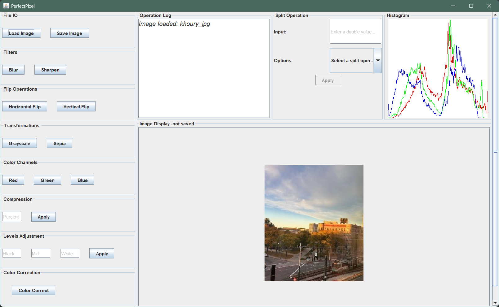

# PerfectPixel: Usage Guide

## 1. Fetching & Passing
In the root directory of the project, the images will be present under:

    inputImages/: This directory holds the input images that the program processes.
    res/outputImages/: This directory stores the output images generated by the program.

You can make use of these existing images and folder structure or choose your own images and folder locations.

## 2. Running the Program

To run the application, follow these steps:

1. Open your terminal or command prompt.
2. Navigate to the root directory of the project.
3. Execute the program utilizing one of the following options:

**Option 1: GUI mode**

If you want to use the GUI mode, execute the command:
  ```
  java -jar res/PerfectPixel.jar
  ```

**Option 2: Interactive mode**

If you want to use interactive mode, execute the command:
  ```
  java -jar res/PerfectPixel.jar -text
  ```

**Option 3: Script Execution Mode**

If you need to pass command line arguments,
- Place the file of your choice in the root directory of the project or utilize `res/AllCommandsScript.txt`.
- Replace `filename` with your desired argument and execute the command:
  ```
  java -jar res/PerfectPixel.jar -file filename
  ```

## 3. GUI Previews



## Appendix: GUI Usage Guide
### **1. File Operations**

#### Load an Image
1. Click on the **File Operations** section in the left panel.
2. Select the **Load Image** button.
3. Choose your image file (supported formats: `.jpeg`, `.jpg`, `.png`, `.ppm`).

#### Save an Image
1. Click on the **File Operations** section.
2. Select the **Save Image** button.
3. Specify the file name and location for saving your image.

### **2. Filters**

#### Blur Image
1. Navigate to the **Filters** section.
2. Click the **Blur** button to apply a blur filter to your image.

#### Sharpen Image
1. Navigate to the **Filters** section.
2. Click the **Sharpen** button to enhance the details of your image.

### **3. Flipping**

#### Horizontal Flip
1. Go to the **Flipping** section.
2. Select **Horizontal Flip** to mirror the image horizontally.

#### Vertical Flip
1. Go to the **Flipping** section.
2. Select **Vertical Flip** to mirror the image vertically.

### **4. Transformations**

#### Grayscale
1. Open the **Transformations** section.
2. Click **Grayscale** to convert the image to grayscale.

#### Sepia
1. Open the **Transformations** section.
2. Click **Sepia** to apply a sepia-tone filter.

### **5. Color Channels**

#### Extract Red Component
1. Navigate to the **Color Channels** section.
2. Click **Extract Red** to isolate the red channel.

#### Extract Green Component
1. Navigate to the **Color Channels** section.
2. Click **Extract Green** to isolate the green channel.

#### Extract Blue Component
1. Navigate to the **Color Channels** section.
2. Click **Extract Blue** to isolate the blue channel.

### **6. Compression**
1. Go to the **Compression** section.
2. Enter the desired compression percentage.
3. Click **Compress** to reduce the file size.

### **7. Levels Adjustment**
1. Open the **Levels Adjustment** section.
2. Specify values for **Black**, **Midtones**, and **White** levels.
3. Click **Apply** to adjust the image levels.

### **8. Color Correction**
1. Open the **Color Correction** section.
2. Click **Correct Colors** to enhance color balance.

### **9. Split Operations**
1. Navigate to the **Split Operations** section.
2. Choose an operation (e.g., **Blur**, **Sharpen**, **Greyscale**, etc.).
3. Adjust the input value as needed.
4. Click **Apply Split** to preview the operation.
5. Use **Save Split** to confirm or **Close Split** to discard.

### **10. Histogram**
1. The histogram is automatically displayed in the **Histogram** section (right panel).
2. It updates whenever an operation is applied to the image.

### **11. Logs and Feedback**
1. Check the **Operation Log** section for a summary of performed operations.
2. This section is located on the right panel.


## Appendix: Script Commands
As all input images are inside /inputImages, user needs to give "inputImages/fileName" to load images.

As all output images are inside /res/outputImages, user needs to give "res/outputImages/fileName" to save image.

This is the done to improvise clarity while loading, manipulation, enhancement and saving of multiple images, avoid confusion and keep images segregated.

Below are some sample examples on how commands should be written in script file to get desired output:
- Load an image and name it\
  `load inputImages/sample.ppm sample`<br/><br/>

- Save a loaded image named "sample"\
  `save inputImages/sample.ppm sample`<br/><br/>

- Create a new image with just the red component\
  `red-component sample sample-red`<br/><br/>

- Create a new image with just the green component\
  `green-component sample sample-green`<br/><br/>

- Create a new image with just the blue component\
  `blue-component sample sample-blue`<br/><br/>

- Create a new image using the value component\
  `value-component sample sample-value`<br/><br/>

- Create a new image using the intensity component\
  `intensity-component sample sample-intensity`<br/><br/>

- Create a new image using the luma component\
  `luma-component sample sample-luma`<br/><br/>

- Split the image into RGB components\
  `rgb-split sample sample-red sample-green sample-blue`<br/><br/>

- Combine 3 different red, green, and blue component images into a single image\
  `rgb-combine sample-new sample-red sample-green sample-blue`<br/><br/>

- Brighten the image by adding a constant (here, 25)\
  `brighten 25 sample sample-brighter`<br/><br/>

- Darken the image by adding a negative constant (here, -25)\
  `brighten -25 sample sample-brighter`<br/><br/>

- Flip the image horizontally\
  `horizontal-flip sample sample-horizontal`<br/><br/>

- Flip the image vertically\
  `vertical-flip sample sample-vertical`<br/><br/>

- Add sepia transform to the image\
  `sepia sample sample-sepia`<br/><br/>

- Add blur filter to the image\
  `blur sample sample-blur`<br/><br/>

- Add sharpen filter to the image\
  `sharpen sample sample-greyscale`<br/><br/>

- Overwrite the image with another file\
  `load inputImages/sample.ppm sample`<br/><br/>

- Run a script file\
  `run sampleScript.txt`<br/><br/>

- Compress an image by a given percentage (here, 25%)\
  `compress 25 image-name dest-image-name`<br/><br/>

- Create an image which is a histogram of the image\
  `histogram image-name dest-image-name`<br/><br/>

- Adjust color balance based on histogram peaks.\
  `color-correct image-name dest-image-name`<br/><br/>

- Enhance contrast using black (b), midtone (m), and white (w) points.\
  `levels-adjust b m w image-name dest-image-name`<br/><br/>

- Generate a split view, applying transformations to a specified portion of the image.\
  `operation image-name dest-image split p` (operation can be blur, sharpen, sepia, greyscale, color-correct or levels-adjust)<br/><br/>

- Manipulate just a part of the image using a mask, in the form of an image.\
  `operation source-image mask-image dest-image` (operation can be blur, sharpen, sepia, greyscale, red-component, blue-component, green-component)<br/><br/>
